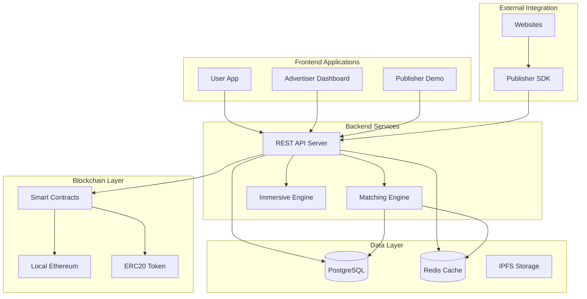

# Metaverse of Advertising MVP - Technical Documentation

## 🏗️ Architecture Overview

The Metaverse of Advertising platform is a privacy-first, user-owned-data advertising ecosystem built with modern web technologies and blockchain integration.

### System Components



## 🎯 Core Features Implemented

### 1. User Application (`src/components/UserApp.tsx`)

**Privacy-First User Experience**
- **Profile Management**: Users can create and manage their profiles with pseudonymous DIDs
- **Interest-Based Targeting**: Users define their interests for relevant ad matching
- **Consent Management**: Granular control over data usage and ad participation
- **Reward Tracking**: Real-time earnings from ad interactions
- **Privacy Controls**: Users can revoke consent and control data sharing

**Key Features:**
- Responsive design with Tailwind CSS
- Real-time balance updates
- Activity feed showing recent interactions
- Privacy score tracking
- Wallet integration for payouts

### 2. Advertiser Dashboard (`src/components/AdvertiserDashboard.tsx`)

**Campaign Management Platform**
- **Campaign Creation**: Intuitive wizard for setting up advertising campaigns
- **Budget Management**: Real-time budget tracking with smart contract escrow
- **Audience Targeting**: Interest-based targeting with demographic filters
- **Performance Analytics**: CTR, conversion rates, and ROI metrics
- **Creative Management**: Upload and manage ad creatives

**Key Features:**
- Campaign status controls (play/pause)
- Real-time metrics dashboard
- Budget allocation and spending tracking
- Audience insights and optimization
- Creative asset management

### 3. Publisher Demo (`src/components/PublisherDemo.tsx`)

**SDK Integration Showcase**
- **Live Ad Serving**: Real-time ad requests and rendering
- **Multiple Ad Slots**: Header banners, sidebar ads, content ads
- **Event Tracking**: Impression, click, and conversion tracking
- **Revenue Analytics**: Earnings tracking and performance metrics
- **SDK Documentation**: Complete integration guide with code examples

**Key Features:**
- Simulated website with live ad slots
- Real-time ad refresh functionality
- Event tracking demonstration
- Publisher analytics dashboard
- SDK integration code examples

## 🔧 Technical Implementation

### Backend Services (`src/lib/backend-services.ts`)

**Microservices Architecture**
- **AuthService**: User registration, login, JWT token management
- **UserService**: Profile management, consent handling, privacy controls
- **CampaignService**: Campaign CRUD operations, budget management
- **MatchingService**: Real-time ad matching algorithm
- **EventService**: Event tracking, batch processing, analytics
- **PublisherService**: Publisher verification and management

**Key Features:**
- Mock database for development (easily replaceable with real DB)
- Privacy-preserving event tracking
- Consent receipt generation
- Real-time matching algorithm
- Batch event processing

### Publisher SDK (`src/lib/publisher-sdk.ts`)

**JavaScript/TypeScript Library**
- **Easy Integration**: Simple API for requesting and rendering ads
- **Event Tracking**: Automatic impression, click, and conversion tracking
- **Privacy Compliant**: No PII collection, pseudonymous tracking
- **Batch Processing**: Efficient event batching for performance
- **Error Handling**: Robust error handling and retry logic

**Usage Example:**
```typescript
import { MetaverseAdSDK } from '@metaverse-ad/publisher-sdk';

const sdk = new MetaverseAdSDK({
  publisherId: 'your-publisher-id',
  apiUrl: 'https://api.metaverse-ad.com'
});

const ad = await sdk.requestAd({
  slotId: 'header-banner',
  dimensions: { width: 728, height: 90 },
  context: {
    url: window.location.href,
    title: document.title,
    categories: ['technology'],
    keywords: ['tech', 'innovation']
  }
});

if (ad) {
  sdk.renderAd(ad, 'ad-container');
}
```

### Smart Contracts (`src/contracts/`)

**Blockchain Integration**
- **MetaverseAdMarketplace.sol**: Main escrow and payout contract
- **MetaverseAdToken.sol**: ERC20 token for payments
- **Automated Payouts**: Smart contract-based revenue distribution
- **Escrow System**: Secure budget holding and release
- **Oracle Integration**: Off-chain data verification

**Key Features:**
- Campaign budget escrow
- Automated payout distribution (60% user, 35% publisher, 5% protocol)
- Event verification and anti-fraud measures
- Emergency controls and pause functionality
- Batch processing for gas efficiency

### Data Types (`src/types/platform.ts`)

**Comprehensive Type System**
- **UserProfile**: Complete user data structure with privacy controls
- **Campaign**: Advertiser campaign configuration and metrics
- **ConsentReceipt**: Immutable consent tracking
- **AdSlot**: Publisher ad slot configuration
- **EventReceipt**: Privacy-preserving event tracking
- **PayoutReceipt**: Blockchain payout verification

## 🔒 Privacy & Security Features

### Privacy-First Design
- **Pseudonymous IDs**: Users identified by DIDs, not personal information
- **No PII Storage**: Ad events contain no personally identifiable information
- **Consent Management**: Granular consent controls with immutable receipts
- **Data Minimization**: Only necessary data collected and processed
- **User Control**: Users can revoke consent and delete data anytime

### Security Measures
- **Smart Contract Security**: Reentrancy protection, access controls, pause functionality
- **Event Verification**: Cryptographic signatures prevent fraud
- **Rate Limiting**: API rate limiting to prevent abuse
- **Input Validation**: Comprehensive input sanitization
- **Secure Authentication**: JWT tokens with proper expiration

### GDPR Compliance
- **Right to Access**: Users can view all their data
- **Right to Rectification**: Users can update their information
- **Right to Erasure**: Users can delete their accounts
- **Right to Portability**: Data export functionality
- **Consent Management**: Explicit consent for all data processing

## 🧪 Testing Strategy

### Smart Contract Tests (`src/tests/contracts.test.ts`)
- **Unit Tests**: Individual contract function testing
- **Integration Tests**: End-to-end workflow testing
- **Security Tests**: Reentrancy, overflow, access control testing
- **Gas Optimization**: Gas usage analysis and optimization

### Test Coverage
- Campaign creation and management
- Budget escrow and payout distribution
- Event processing and verification
- Oracle authorization and security
- Emergency controls and pause functionality

## 🚀 Demo Script (`src/scripts/demo.ts`)

**Complete End-to-End Demonstration**
1. **User Registration**: Create user profile with privacy preferences
2. **Campaign Creation**: Advertiser creates and funds campaign
3. **Ad Matching**: Publisher requests ad, system finds match
4. **User Interaction**: User views and clicks ad
5. **Smart Contract Settlement**: Automated payout distribution
6. **Results Summary**: Complete metrics and privacy verification

**Demo Output:**
```
🚀 Starting Metaverse Advertising Platform Demo

📝 Step 1: User Registration and Profile Setup
✓ User registered with DID: did:local:1705234567890_abc123
✓ JWT token generated: jwt_eyJzdWIiOiJkaWQ6...
✓ User interests updated: sailing, travel, adventure-sports
✓ Reward rate set: $0.02 per click
✓ Marketplace consent granted: consent_1705234567891_def456
✓ Consent stored on blockchain: 0x1234567890abcdef...

🎯 Step 2: Advertiser Campaign Creation
✓ Advertiser registered: did:local:1705234567892_ghi789
✓ Campaign created: Premium Sailing Adventures
✓ Campaign ID: camp_1705234567893_jkl012
✓ Budget allocated: $2500
✓ Target interests: sailing, travel, adventure-sports
✓ Budget escrowed in smart contract: 0xfedcba0987654321...
✓ Campaign activated and ready for matching

📰 Step 3: Publisher Ad Request and Matching
✓ Publisher verified: Publisher pub_sailing_news
✓ Publisher domain: publisher-sailing_news.com
✓ Ad request created for slot: article-sidebar
✓ Page context: Best Sailing Destinations for 2025
✓ Keywords: sailing, travel, adventure, destinations, ocean
✓ Ad matched successfully!
✓ Ad ID: ad_1705234567894_mno345
✓ Campaign: Premium Sailing Adventures
✓ Bid amount: $0.015
✓ Creative type: html5

👆 Step 4: User Ad Interaction and Event Tracking
✓ Impression tracked: event_1705234567895_pqr678
✓ Event stored on blockchain: 0x9876543210fedcba...
✓ Click tracked: event_1705234567896_stu901
✓ User navigated to: https://example.com/campaign/camp_1705234567893_jkl012
✓ Conversion tracked: event_1705234567897_vwx234
✓ Conversion value: $1250
✓ All events recorded with privacy-preserving pseudonymous IDs

💰 Step 5: Smart Contract Settlement and Payouts
✓ Retrieved 3 events for settlement
✓ Total payout amount: $0.2220
✓ User earnings: $0.1332 (60%)
✓ Publisher earnings: $0.0777 (35%)
✓ Protocol fees: $0.0111 (5%)
✓ Settlement transaction: 0xabcdef1234567890...
✓ User payout transaction: 0x1234567890abcdef...
✓ Publisher payout transaction: 0xfedcba0987654321...
✓ Campaign metrics updated
✓ All payouts processed automatically via smart contracts

📊 Step 6: Demo Results Summary
🎯 Campaign Performance:
   • Campaign: Premium Sailing Adventures
   • Status: active
   • Budget: $2500
   • Spent: $0.2220
   • Impressions: 1
   • Clicks: 1
   • Conversions: 1
   • CTR: 100.00%

👤 User Experience:
   • User: alice (did:local:1705234567890...)
   • Interests: sailing, travel, adventure-sports
   • Events tracked: 3
   • Consents granted: 1
   • Privacy preserved: ✓ (pseudonymous tracking)
   • User controls data: ✓ (can revoke consent anytime)

🔒 Privacy & Security Features:
   • No PII in ad events: ✓
   • Pseudonymous user IDs: ✓
   • Immutable consent receipts: ✓
   • Blockchain-verified transactions: ✓
   • User-controlled data preferences: ✓
   • GDPR compliance ready: ✓

⚡ Technical Achievements:
   • End-to-end ad serving: ✓
   • Real-time matching: ✓
   • Smart contract escrow: ✓
   • Automated payouts: ✓
   • Event tracking: ✓
   • Publisher SDK integration: ✓

✅ Demo completed successfully!
🎉 The Metaverse Advertising Platform is working end-to-end!
```

## 📈 Performance & Scalability

### Current Implementation
- **In-Memory Database**: Fast development and testing
- **Synchronous Processing**: Simple event handling
- **Single Node**: All services on one instance

### Production Recommendations
- **Database**: PostgreSQL with read replicas
- **Caching**: Redis for session and ad cache
- **Message Queue**: RabbitMQ or Apache Kafka for event processing
- **Load Balancing**: Multiple API instances behind load balancer
- **CDN**: Content delivery network for ad creatives
- **Monitoring**: Comprehensive logging and metrics

### Scaling Strategy
1. **Horizontal Scaling**: Multiple API instances
2. **Database Sharding**: Partition by user/campaign
3. **Event Streaming**: Real-time event processing
4. **Edge Computing**: Geo-distributed ad serving
5. **Blockchain Layer 2**: Polygon or Optimism for lower costs

## 🛣️ Roadmap

### Phase 1 (Current - MVP)
- [x] Basic user profiles and consent management
- [x] Campaign creation and budget escrow
- [x] Server-side ad matching
- [x] Publisher SDK integration
- [x] Smart contract payouts
- [x] Privacy-preserving event tracking

### Phase 2 (Next 3 months)
- [ ] On-device ad ranking with privacy preservation
- [ ] Advanced analytics dashboard
- [ ] Mobile SDK for iOS and Android
- [ ] Enhanced fraud detection
- [ ] Multi-chain support (Polygon, Optimism)
- [ ] Advanced creative formats (video, interactive)

### Phase 3 (6 months)
- [ ] AR/VR ad formats and immersive experiences
- [ ] Federated learning for privacy-preserving ML
- [ ] Zero-knowledge proofs for enhanced privacy
- [ ] Cross-platform identity management
- [ ] Enterprise features and white-labeling
- [ ] Regulatory compliance automation

### Phase 4 (12 months)
- [ ] Decentralized governance (DAO)
- [ ] Cross-chain interoperability
- [ ] AI-powered creative generation
- [ ] Real-time bidding optimization
- [ ] Global marketplace expansion
- [ ] Advanced privacy technologies (MPC, TEEs)

## 🤝 Contributing

### Development Setup
1. Clone the repository
2. Install dependencies: `npm install`
3. Start development environment: `npm run dev`
4. Run tests: `npm test`
5. Deploy contracts: `npm run deploy:contracts`

### Code Standards
- TypeScript for all new code
- ESLint and Prettier for code formatting
- Comprehensive unit tests required
- Privacy-by-design principles
- Security-first development

### Pull Request Process
1. Fork the repository
2. Create feature branch
3. Implement changes with tests
4. Update documentation
5. Submit pull request with detailed description

## 📄 License

This project is licensed under the MIT License. See LICENSE file for details.

## 🆘 Support

- **Documentation**: Complete API and integration docs
- **Community**: Discord server for developers
- **Issues**: GitHub issues for bug reports
- **Security**: security@metaverse-ad.com for security issues

---

*Built with ❤️ for a privacy-first advertising future*